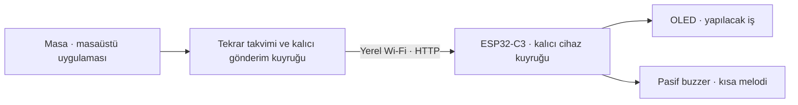

# Masa · ESP32C-Reminder

**Aklında kalmasın. Masanda dursun.**

[](https://github.com/yakutozcan/ESP32C-Reminder/actions/workflows/ci.yml)
[](LICENSE)
[](https://github.com/tarwin/tinyjsapp)
[](firmware/)

Masa; günlük, haftalık ve aylık rutinlerini hatırlatan, açık kaynak bir masaüstü
uygulaması ve ESP32-C3 cihaz yazılımıdır. Hatırlatma zamanı geldiğinde aynı Wi-Fi
ağı üzerindeki cihazın OLED ekranında yapılacak işi gösterir ve **5 V pasif buzzer**
ile kısa bir melodi çalar. Her hatırlatıcı için sessiz bildirim de seçilebilir.

Masaüstü uygulaması [tinyjsapp](https://github.com/tarwin/tinyjsapp), cihazın Wi-Fi
kurulumu [AyresWiFiManager](https://registry.platformio.org/libraries/ayresnet/AyresWiFiManager)
kullanır. Takvim ve veriler bilgisayarında saklanır; ayrı bir sunucu veya bulut
hesabı gerekmez.


*Uygulama arayüzünün örnek verilerle tarayıcı önizlemesi. Görseldeki notlar ve
bağlantı durumu temsilidir; kişisel veriler içermez.*

[Kurulum](#kurulum) · [Donanım](docs/hardware.md) · [Cihaz protokolü](docs/protocol.md) · [Katkıda bulun](CONTRIBUTING.md)

## Özellikler

- Günlük tekrar, haftanın birden fazla günü veya ayın belirli günü.
- Hatırlatıcı ekleme, düzenleme, duraklatma, silme ve silmeyi geri alma.
- Türkçe ajanda, günlük görünüm ve bildirim geçmişi.
- Her hatırlatıcı için yaklaşık bir saniyelik melodi veya sessiz bildirim.
- Pencere kapandığında sistem tepsisinde/menü çubuğunda çalışma.
- Paketlenmiş uygulamada oturum açıldığında başlatma seçeneği.
- Şifresiz cihaz kurulum ağı, otomatik **2,4 GHz** Wi-Fi taraması ve gizli ağ girişi.
- Bilgisayarda kalıcı gönderim kuyruğu ve bağlantı kesilince yeniden deneme.
- Cihazda kalıcı kuyruk ve aynı bildirimin yeniden gönderilmesini ayırt etme.
- Küçük OLED’de uzun notları sayfalama; BOOT’a kısa basarak bildirimi kapatma.
- Donanım olmadan denemek için yerel cihaz simülatörü.
- MIT lisansı ve GitHub Actions ile otomatik kontroller.

## Nasıl çalışır?



**Bilgisayar açık ve Masa çalışıyor olmalı.** Bilgisayar uyurken, kapalıyken veya
uygulamadan tamamen çıkıldığında yeni bildirim gönderilmez. Pencereyi kapatmak
uygulamadan çıkmak anlamına gelmez; Masa arka planda çalışmayı sürdürür.

Bilgisayar geri açıldığında her hatırlatıcının son 24 saat içindeki **en son**
kaçırılan tekrarı gönderilir. Daha eski tekrarlar atlanır. Cihaz çevrimdışıysa
bekleyen teslimat, hatırlatma saatinden 24 saat sonra sona erer. Gelecekteki takvim
cihaza aktarılmaz; zamanlamayı bilgisayar yönetir.

## Gereksinimler

| Bileşen | Gereksinim |
| --- | --- |
| Masaüstü ortamı | [tinyjs 0.47.1+](https://tinyjs.app/docs) |
| Testler ve simülatör | Node.js 22+ |
| Firmware araçları | [PlatformIO](https://docs.platformio.org/en/latest/core/installation/index.html); CI sürümü 6.1.19 |
| Kart | [ABRobot ESP32-C3 0.42 OLED · USB Type-C](https://emalliab.wordpress.com/2025/02/12/esp32-c3-0-42-oled/) |
| Bildirim sesi | 5 V **pasif** buzzer, uygun MOSFET sürücü ve bağlantı parçaları |
| Ağ | Bilgisayar ile cihazın erişebildiği aynı yerel ağ; ESP32 için 2,4 GHz Wi-Fi |

Masaüstü uygulaması tinyjs’in txiki.js sürecini kullanır. Çalıştırmak için ayrı Go
veya Node.js sunucusu, npm bağımlılığı ya da hesap gerekmez. Donanım parçaları ve
bağlantı şeması [donanım kılavuzunda](docs/hardware.md) bulunur.

Doğrulanan ortam **macOS Apple Silicon** ve yukarıdaki ESP32-C3 OLED kartıdır.
Windows/Linux paketleri ve diğer kart varyantları henüz donanım üzerinde
doğrulanmamıştır. Paketleri hedef işletim sisteminde oluştur.

## Kurulum

### 1. Masaüstü uygulamasını aç

Önce [tinyjs’i kur](https://tinyjs.app/docs), ardından:

```sh
git clone https://github.com/yakutozcan/ESP32C-Reminder.git
cd ESP32C-Reminder
tinyjs dev
```

Paketlenmiş uygulama oluşturmak için:

```sh
tinyjs build
```

macOS’ta `dist/Masa — Hatırlatıcı.app` oluşur. Applications klasörüne taşıyıp
açabilirsin. İmzalama/notarizasyon için tinyjs belgelerindeki paketleme adımlarını
uygula. Node.js yalnızca aşağıdaki testler, simülatör ve statik önizleme için gerekir.

### 2. ESP32’ye yazılımı yükle

PlatformIO’yu kur ve kartı USB-C ile bağla. Wi-Fi bilgilerini kaynak koduna
yazman gerekmez.

```sh
pio run -d firmware
pio run -d firmware -t upload
pio device monitor -b 115200
```

Birden fazla seri cihaz varsa yükleme komutuna `--upload-port <PORT>` ekle.
İlk yüklemede kart bulunamazsa BOOT’u basılı tutup RESET’e bas ve bırak; yükleme
bağlantısı kurulunca BOOT’u bırak. USB CDC firmware’de açıktır.

Hedef ekran SSD1306’dır: SDA **GPIO5**, SCL **GPIO6**, adres **0x3C**.
Görünür alan 72×40 pikseldir; firmware 128×64 tamponda `(30,12)` ofset kullanır.
Kart varyantlarında pinleri ve ofsetleri `firmware/include/config.h` ile ayarla.

### 3. Cihazı Wi-Fi’ye bağla

1. Bilgisayarını veya telefonunu cihazın açtığı **Masa-XXXX** ağına **şifresiz** bağla.
   Ağın adı OLED’de ve seri monitörde görünür.
2. Kurulum sayfası otomatik açılmazsa **http://192.168.4.1** adresini aç.
3. Sayfadaki **cihaz anahtarını** kopyala. Otomatik taranan ağlardan kendi
   **2,4 GHz Wi-Fi ağını** seç; şifreliyse o ağın şifresini gir.
4. **Wi-Fi’ye bağlan** düğmesine bas. Cihaz kaydedip yeniden başlar.
5. Bilgisayarını kendi Wi-Fi ağına geri bağla.
6. Masa’da sol alttaki **ESP32-C3 OLED** düğmesini aç. Adres olarak
   `http://masa-reminder.local`, anahtar olarak kopyaladığın değeri gir.
7. **Bağlantıyı kontrol et** düğmesine bas. mDNS çalışmıyorsa seri monitördeki
   `Masa IP: http://192.168.x.x` adresini kullan.

Şifresiz olan cihazın geçici **kurulum ağıdır**; ev/ofis ağının kendi şifresi
varsa bağlantı için bu şifre gerekir. Gizli ağın adını elle yazabilirsin.
**Yeniden tara** listeyi günceller; Ayres tarama sonuçlarını 20 saniye önbellekte tutar.
Türkçe sayfa firmware tarafından hazırlanır; ayrıca dosya sistemi yüklemesi gerekmez.

Wi-Fi’yi değiştirmek için BOOT’u **5 saniye** basılı tut. İlk bağlantı denemesi
başarısız olursa kurulum ağı açılır; normal kullanımda bağlantı kesilirse yeniden
bağlanmayı sürdürür. Ayarlar ve cihaz anahtarı yeniden başlatmada korunur.

### 4. Buzzerı bağla ve ilk notunu ekle

[Bağlantı kılavuzuna](docs/hardware.md) göre buzzerı **GPIO3**, MOSFET sürücü ve
5 V besleme ile bağla. **5 V buzzerı doğrudan ESP32 GPIO’suna bağlama.**
Besleme ile ESP32’nin GND bağlantısı ortak olmalı.

Masa’dan **Test bildirimi** gönder; OLED’i ve kısa melodiyi kontrol et. Sonra
**Yeni hatırlatıcı** ile başlığını, tekrarını, saatini ve ses tercihini kaydet.
`⌘N` / `Ctrl+N` de yeni hatırlatıcı açar.

## Cihaz olmadan dene

Node.js 22+ kuruluysa, iki ayrı terminalde:

```sh
# Birinci terminal: yerel cihaz simülatörü
npm run simulator
```

```sh
# İkinci terminal: masaüstü uygulaması
tinyjs dev
```

Cihaz ayarlarında adresi `http://127.0.0.1:8787`, anahtarı
`local-simulator-token-12345678` olarak gir. Bu anahtar yalnızca örnek simülatör
anahtarıdır. Test bildirimi simülatörün terminalinde görünür. Farklı bir anahtar
için `DEVICE_TOKEN` ortam değişkenini kullan.

Simülatör yalnızca bu bilgisayardan erişilen loopback adresini dinler; fiziksel
OLED ve buzzerı taklit etmez. `npm run preview` ise arayüzün statik önizlemesidir;
masaüstü zamanlayıcısını veya cihaz bağlantısını çalıştırmaz.

## Kullanım ve sınırlar

- Saatler bilgisayarın yerel saat dilimindedir. Saat dilimini değiştirdiğinde
  mevcut hatırlatıcıyı düzenleyip kaydetmek yeni dilimde hesaplanmasını sağlar.
- Ayın 29/30/31’i kısa aylarda son güne uyarlanır; sonraki ay asıl güne döner.
- Yaz saati geçişinde var olmayan saat ileri kaydırılır; tekrar yaşanan saatte
  aynı gün için bir kez bildirim gönderilir.
- Cihaz kuyruğu 8 bildirim tutar. Bekleyen ve son 32 tamamlanan kimlik için
  yinelenen gönderimler tekrar eklenmez.
- **Cihaz kabul etti**, bildirimin kalıcı kuyruğa alındığı anlamına gelir;
  görevin yapıldığını veya buzzerdan ses çıktığını doğrulamaz.
- Cihazda kabul edilmiş notlar masaüstünden silinince geri çekilmez. Görüntüleme
  sırasında cihaz yeniden başlarsa mevcut not tekrar gösterilebilir.
- OLED’de Türkçe harfler Latin karşılıklarına dönüştürülür; desteklenmeyen
  karakterler `?` olarak görünür. Uzun notlar üç satırlık sayfalara bölünür.
- BOOT’a kısa basmak mevcut bildirimi kapatır. **Bilgisayar açıldığında başlat**
  ayarı paketlenmiş uygulamada kullanılabilir; macOS onay isterse Giriş Öğeleri’ni kontrol et.

## Veriler ve gizlilik

Hatırlatıcılar, cihaz adresi ve anahtar, tinyjs’in uygulama verisi klasöründeki
`store.json` dosyasında yerel olarak saklanır:

| Sistem | Klasör |
| --- | --- |
| macOS | `~/Library/Application Support/io.github.esp32c-reminder/` |
| Windows | `%APPDATA%\io.github.esp32c-reminder\` |
| Linux | `~/.local/share/io.github.esp32c-reminder/` |

Yedeklemek için uygulamadan çıkıp bu dosyayı kopyala. Dosya cihaz anahtarını açık
metin içerir; GitHub’a veya hata raporuna yükleme. Cihazın Wi-Fi bilgileri LittleFS’de,
anahtarı ve bildirim kuyruğu NVS’de tutulur.

Cihaz iletişimi **HTTP** kullanır; anahtar ve notlar ağda şifrelenmez. Bu sürüm
güvenilen yerel ağ içindir. Cihazın portunu internete açma.
`firmware/include/config.h`, derleme çıktıları ve kişisel veri dosyaları Git dışında tutulur.

## Sorun giderme

| Durum | Kontrol |
| --- | --- |
| Wi-Fi listesi boş | 2,4 GHz ağın açık olduğundan emin ol, 20 saniye sonra yeniden tara; gizli ağ için adını elle gir. |
| Kurulum sayfası açılmıyor | `Masa-XXXX` ağına bağlıyken doğrudan `http://192.168.4.1` adresini aç. |
| Cihaza ulaşılamıyor | Bilgisayar ile ESP32 aynı yerel ağda olmalı; misafir ağı/istemci izolasyonu ve mDNS yerine cihaz IP’sini kontrol et. |
| Anahtar uyuşmuyor | Kurulum sayfası veya seri monitördeki `INFO` anahtarını cihaz ayarlarına kopyala. |
| OLED boş | Kartın GPIO5/GPIO6, `0x3C` adresi ve ekran ofsetlerini donanım kılavuzuyla karşılaştır. |
| Buzzer sessiz | Pasif buzzer, 5 V besleme, MOSFET ve ortak GND’yi kontrol et; ses tercihi **Kısa melodi** olmalı. |
| Bildirim geç geliyor | Bilgisayar uyumuş, uygulama kapalı veya cihaz çevrimdışı olabilir; teslimat geçmişini kontrol et. |

Seri monitör komutları:

| Komut | İşlev |
| --- | --- |
| `INFO` | Bağlantı durumu, OLED, ses görevi ve cihaz anahtarı |
| `SETUP` | Kayıtlı Wi-Fi’yi silmeden kurulum ağı açma |
| `SCAN` | Kurulum modunda Ayres’in gerçek tarama ve Türkçe sayfa kontrolü |
| `TEST` | Wi-Fi kurulmadan da kalıcı bildirim ve melodi yazılım testi |

## Geliştirme

```sh
npm test
pio run -d firmware
```

GitHub Actions bu iki kontrolü çalıştırır. Testler takvim sınırlarını, yaz/kış saati
geçişlerini, kuyruk kalıcılığını, yeniden denemeleri, disk hatalarını ve gerçek HTTP
üzerinden protokolü doğrular. Fiziksel ekran ve ses için ayrıca cihaz testi gerekir.

Firmware bağımlılıkları sabitlenmiştir: ESP32 platformu **6.9.0**,
ArduinoJson **6.21.5**, U8g2 **2.36.15**, AyresWiFiManager **2.3.0**.
`firmware/scripts/ayres_compat.py`, tarama uyumluluğu için yalnızca derleme
klasöründeki kopyaları düzeltir; kurulu kütüphaneleri değiştirmez.
Bağımlılık sürümlerini yükseltirken bu düzeltmeleri de gözden geçir.

```text
src/main.js         Masaüstü yaşam döngüsü ve tinyjs API’si
src/core/           Tekrar takvimi, gönderim kuyruğu ve cihaz protokolü
src/frontend/       Türkçe ajanda, cihaz ayarları ve yerel yazı tipleri
firmware/           ESP32-C3 Arduino/PlatformIO yazılımı
tests/             Takvim, kuyruk ve HTTP testleri
tools/             Cihaz simülatörü ve statik önizleme
docs/              Donanım bağlantısı, protokol ve ekran görüntüsü
```

## Önceki sürümlerden geçiş

Masa **0.2.0** ve firmware **0.2.2**, önceki titreşim tercihlerini melodi/sessiz
tercihlerine dönüştürür. Takvimler ve bekleyen teslimat kimlikleri korunur. Eski
masaüstü kaydı dönüşümden önce `reminder-state-v1-backup` anahtarına yedeklenir.
Eski uygulamaya dönmek gerekirse Masa’dan çıkıp yedeği `reminder-state` alanına
kopyala; yedekten sonraki değişiklikler eski sürüme aktarılmaz. Yeni masaüstü
uygulaması **protokol 2** gerektirir; önce cihaz yazılımını güncelle.

Eski NVS Wi-Fi kaydı yalnızca ilk geçişte Ayres’in `/wifi.json` dosyasına aktarılır;
eski kayıt geri dönüş için korunur. Normal firmware güncellemelerinde dosya
sistemi yüklemesi gerekmez. **`uploadfs` Wi-Fi ayarlarını değiştirebilir.**

İsteğe bağlı derleme ayarları için `firmware/include/config.example.h` dosyasını
`firmware/include/config.h` olarak kopyala. Boş cihaz anahtarında firmware kendine
kalıcı bir anahtar üretir; tarayıcıdan kaydedilmiş Wi-Fi ayarları önceliklidir.

## Katkı ve lisans

Hata raporları ve pull request’ler açıktır. Başlangıç için [katkı kılavuzunu](CONTRIBUTING.md)
oku; sorunları [GitHub Issues](https://github.com/yakutozcan/ESP32C-Reminder/issues)
üzerinden bildir. Rapora cihaz anahtarı, Wi-Fi şifresi veya kişisel hatırlatıcı ekleme.

Projenin özgün kodu **[MIT](LICENSE)** lisanslıdır. Newsreader ve IBM Plex Sans,
yanlarında bulunan SIL Open Font License dosyalarıyla dağıtılır. Kullanılan
üçüncü taraf kütüphaneler kendi lisanslarına tabidir. Katkı ve bağımlılık bağlantıları:

- [tinyjsapp](https://github.com/tarwin/tinyjsapp)
- [AyresWiFiManager](https://github.com/ayresnet/AyresWiFiManager)
- [U8g2](https://github.com/olikraus/u8g2)
- [ArduinoJson](https://github.com/bblanchon/ArduinoJson)
- [ABRobot OLED kartı referansı](https://emalliab.wordpress.com/2025/02/12/esp32-c3-0-42-oled/)
