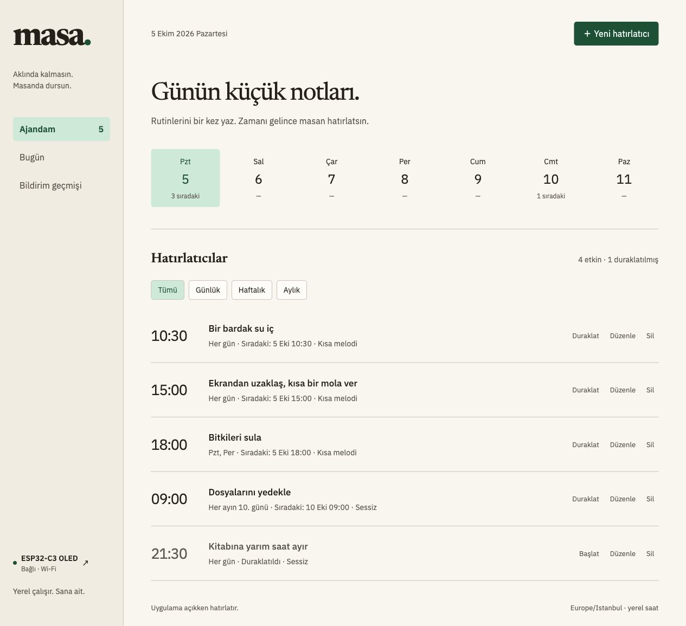
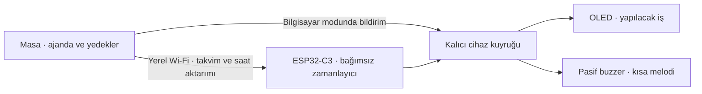

# Masa · ESP32C-Reminder

**Aklında kalmasın. Masanda dursun.**

[](https://github.com/yakutozcan/ESP32C-Reminder/actions/workflows/ci.yml)
[](LICENSE)
[](https://github.com/tarwin/tinyjsapp)
[](firmware/)

Masa; tek seferlik, günlük, haftalık, aylık, aralıklı ve cron kurallı işlerini hatırlatan, açık kaynak bir masaüstü
uygulaması ve ESP32-C3 cihaz yazılımıdır. Hatırlatma zamanı geldiğinde aynı Wi-Fi
ağı üzerindeki cihazın OLED ekranında yapılacak işi gösterir ve **5 V pasif buzzer**
ile kısa bir melodi çalar. Her hatırlatıcı için sessiz bildirim de seçilebilir.

Masaüstü uygulaması [tinyjsapp](https://github.com/tarwin/tinyjsapp), cihazın Wi-Fi
kurulumu [AyresWiFiManager](https://registry.platformio.org/libraries/ayresnet/AyresWiFiManager)
kullanır. Takvim ve veriler bilgisayarında saklanır; ayrı bir sunucu veya bulut
hesabı gerekmez. **Masa 0.8.0 / firmware 0.8.0** ile takvimi cihaza aktarıp
bilgisayar kapalıyken de hatırlatmasını sağlayabilirsin.



*Uygulama arayüzünün örnek verilerle tarayıcı önizlemesi. Görseldeki notlar ve
bağlantı durumu temsilidir; kişisel veriler içermez.*

[Kurulum](#kurulum) · [Donanım](docs/hardware.md) · [Cihaz protokolü](docs/protocol.md) · [Özellik planı](docs/roadmap.md) · [Katkıda bulun](CONTRIBUTING.md)

## Özellikler

- **Her gün, Her saat, Her 2 saatte** hazır seçenekleri; haftanın birden fazla günü veya ayın belirli günü.
- Beş alanlı **cron** ifadeleri, hazır örnekler ve sonraki üç hatırlatmanın önizlemesi.
  Cron zamanlaması bilgisayarda ve firmware 0.7.0+ ile bağımsız cihazda çalışır.
- Başlangıç haftası seçerek iki haftada bir tekrar; 1–10080 dakika aralıklarla,
  seçili günlerde ve çalışma saatlerinde hatırlatma.
- Tarih ve saat seçerek tek seferlik hatırlatma; **30 dakika sonra** kısayolu.
- Bildirim geçmişinden **5 / 15 / 30 dakika** erteleme; tekrar takvimi korunur.
- Hatırlatıcı ekleme, düzenleme, duraklatma, silme ve silmeyi geri alma.
- Türkçe ajanda, günlük görünüm ve bildirim geçmişi.
- Teslimat durumundan ayrı **Yaptım** işaretleme ve günlük **Yapılanlar** görünümü.
- Cihazda BOOT'a çift basarak tamamlandı, 1 saniye basıp bırakarak 15 dakika erteleme;
  işlemler cihazda saklanır ve uygulamaya bir kez aktarılır (firmware 0.3.0+).
- Her hatırlatıcı için yaklaşık bir saniyelik melodi veya sessiz bildirim.
- Gece yarısını geçen sessiz saatler; ekran notları görünmeye devam eder.
- JSON yedeği indirme; başlıkları inceleyerek birleştirme veya ajandanın yerine
  koyma. Cihaz anahtarı dışa aktarılmaz; işlem öncesinde tam yerel yedek alınır.
- Bilgisayardan bağımsız cihaz zamanlaması, NTP/UTC saat eşitlemesi ve tek
  zamanlayıcı sahipliği (firmware 0.6.0 / protokol 4).
- Pencere kapandığında sistem tepsisinde/menü çubuğunda çalışma.
- Paketlenmiş uygulamada oturum açıldığında başlatma seçeneği.
- Şifresiz cihaz kurulum ağı, otomatik **2,4 GHz** Wi-Fi taraması ve gizli ağ girişi.
- Bilgisayarda kalıcı gönderim kuyruğu ve bağlantı kesilince yeniden deneme.
- Cihazda kalıcı kuyruk ve aynı bildirimin yeniden gönderilmesini ayırt etme.
- Küçük OLED’de uzun notları sayfalama; BOOT’a kısa basarak bildirimi kapatma.
- Boşta saat, sıradaki not ve kalan süre; BOOT ile uyanma.
- Ayarlardan **ekranı sürekli açık tutma**, boşta kapanma süresi ve hatırlatmadan
  önce/sonra açık kalma aralıkları (firmware 0.8.0+).
- Donanım olmadan denemek için yerel cihaz simülatörü.
- MIT lisansı ve GitHub Actions ile otomatik kontroller.

## Nasıl çalışır?



Varsayılan **bilgisayar modunda** Masa açık olmalı. Pencereyi kapatmak uygulamadan
çıkmak anlamına gelmez; Masa arka planda çalışmayı sürdürür. Cihaz ayarlarında
**Takvimi cihazda çalıştır** seçeneğini açıp aktarımı tamamladığında ESP32
hatırlatmaları kendisi başlatır; bilgisayar uyuyabilir veya kapanabilir.

Bağımsız modda en fazla **24 hatırlatıcı ve 24 bekleyen erteleme** saklanır. Bir
takvimi tek bilgisayar yönetir; başka bilgisayara geçiş açık devir ister. Aktarım
yanıtı kaybolursa bilgisayar zamanlamayı devralmaz; yeniden eşitleme onayı
beklenir. Cihaz açıkken ağ kopsa da güvenilir saatiyle devam eder. Cihaz yeniden
başlatılırsa **NTP veya Masa'dan UTC aktarımı** alınana kadar yeni hatırlatmalar bekler.

Bilgisayar geri açıldığında her hatırlatıcının son 24 saat içindeki **en son**
kaçırılan tekrarı gönderilir. Daha eski tekrarlar atlanır. Cihaz çevrimdışıysa
bekleyen teslimat, hatırlatma saatinden 24 saat sonra sona erer. Bu davranış
bilgisayar moduna aittir. Bağımsız modda aynı kaçırılan tekrar kuralını cihaz
uygular; geçmiş ve düğme işlemleri bağlantı gelince Masa'ya aktarılır.

## Kolay tekrarlar ve cron

**Her gün** seçeneğinde bir saat belirle. **Her saat** ve **Her 2 saatte**,
kayıt anından itibaren 60 veya 120 dakika aralıklarla hatırlatır. Daha farklı
aralıklar ve çalışma saatleri için **Belirli aralıklarla** seçeneğini kullan.

**Cron** seçildiğinde `dakika saat ayın-günü ay haftanın-günü` biçiminde bir
kural gir. Uygulama sonraki üç tarihi bilgisayarının yerel saatine göre gösterir.

| İfade | Hatırlatma zamanı |
| --- | --- |
| `0 * * * *` | Her saat başı |
| `0 */2 * * *` | 00:00, 02:00, 04:00… |
| `0 9 * * *` | Her gün 09:00 |
| `0 9 * * 1-5` | Hafta içi 09:00 |
| `*/15 9-17 * * MON-FRI` | Hafta içi 09:00–17:59 arasında her 15 dakika |

Liste, aralık ve adım desteklenir; ay/gün adları İngilizce üç harftir.
`@hourly`, `@daily`, `@weekly`, `@monthly`, `@yearly` de kullanılabilir.
Ayın günü ve haftanın günü birlikte kısıtlandığında iki koşuldan birinin
sağlanması yeterlidir. Yaz saati geçişinde olmayan dakikalar atlanır; iki kez
yaşanan dakika iki ayrı hatırlatma oluşturur. Bu kurallar
[Cronie zamanlama biçimi](https://github.com/cronie-crond/cronie/blob/master/man/crontab.5)
ile uyumludur. Cron alanı hatırlatmanın zamanını belirler; komut alanı bulunmaz.

Bağımsız cihazda cron için firmware **0.7.0+** gerekir. Eski firmware ile
günlük/aralıklı takvim devam eder; cron ekleme veya aktarma öncesinde uygulama
güncelleme ister. Yerel kayıt biçimi 7'ye geçirilmeden önce mevcut kayıt yedeklenir.

## Ekran ayarları

**Ayarlar ve yedekler → Ekran** bölümünde:

- **Ekranı sürekli açık tut:** zamanlama ve boşta kapanma süresinden bağımsız açık kalır.
- **Boştayken kapanma süresi:** 1–1440 dakika; varsayılan 2 dakika. Sürenin yarısında ekran kısılır.
- **Hatırlatmadan önce uyan:** 0–1440 dakika; varsayılan 10 dakika.
- **Hatırlatmadan sonra açık kal:** 0–1440 dakika; varsayılan 10 dakika.

Örneğin 15:00 hatırlatması için varsayılan aralık 14:50–15:10'dur. Önce veya
sonra süresini 0 yaparak o aralığı kapatabilirsin. Sürekli açık seçeneğini
kapattığında kaydettiğin süreler yeniden uygulanır. Bildirimler ve BOOT ekranı
her zaman uyandırır; yakın hatırlatmaların aralıkları birleşir.

Tercihler cihaza kalıcı olarak aktarılır ve yedeğe dahil edilir. Bağlantı
kesikse uygulama yerel kaydı korur ve aktarım beklediğini gösterir. Bilgisayar
modunda sıradaki hatırlatma zamanı Masa açıkken cihaza aktarılır; bağımsız
modda cihaz kendi takvimini kullanır. Zamanlı uyanma için cihazın güvenilir
saati gerekir; sürekli açık seçeneği saat eşitlenmeden de çalışır.

Bu bölüm için firmware **0.8.0+** gerekir. Eski firmware diğer özelliklerle
çalışmaya devam eder; ekran ayarlarının aktarılmadığı açıkça gösterilir.

## Gereksinimler

| Bileşen | Gereksinim |
| --- | --- |
| Masaüstü ortamı | [tinyjs 0.47.1+](https://tinyjs.app/docs) |
| Testler ve simülatör | Node.js 22+ |
| Firmware araçları | [PlatformIO](https://docs.platformio.org/en/latest/core/installation/index.html); CI sürümü 6.1.19 |
| Kart | [ABRobot ESP32-C3 0.42 OLED · USB Type-C](https://emalliab.wordpress.com/2025/02/12/esp32-c3-0-42-oled/) |
| Bildirim sesi | 5 V **pasif** buzzer, uygun MOSFET sürücü ve bağlantı parçaları |
| Ağ | Bilgisayar ile cihazın erişebildiği aynı yerel ağ; ESP32 için 2,4 GHz Wi-Fi |

Masaüstü uygulaması tinyjs’in txiki.js sürecini kullanır. Çalıştırmak için ayrı Go
veya Node.js sunucusu, npm bağımlılığı ya da hesap gerekmez. Donanım parçaları ve
bağlantı şeması [donanım kılavuzunda](docs/hardware.md) bulunur.

Yazılım ve paketleme hedefi **macOS Apple Silicon**, firmware hedefi yukarıdaki
ESP32-C3 OLED kartıdır. 0.6.0 bağımsız takvim devri gerçek USB kartta doğrulandı;
Cron üretimi ve OLED görünürlüğünün fiziksel doğrulaması ayrıca yapılmalıdır. Windows/Linux paketleri ve diğer kart varyantları da ayrıca
denenmelidir. Paketleri hedef işletim sisteminde oluştur.

## Kurulum

### 1. Masaüstü uygulamasını aç

Önce [tinyjs’i kur](https://tinyjs.app/docs), ardından:

```sh
git clone https://github.com/yakutozcan/ESP32C-Reminder.git
cd ESP32C-Reminder
tinyjs dev
```

Paketlenmiş uygulama oluşturmak için:

```sh
tinyjs build
```

macOS’ta `dist/Masa — Hatırlatıcı.app` oluşur. Applications klasörüne taşıyıp
açabilirsin. İmzalama/notarizasyon için tinyjs belgelerindeki paketleme adımlarını
uygula. Node.js yalnızca aşağıdaki testler, simülatör ve statik önizleme için gerekir.

### 2. ESP32’ye yazılımı yükle

PlatformIO’yu kur ve kartı USB-C ile bağla. Wi-Fi bilgilerini kaynak koduna
yazman gerekmez.

```sh
pio run -d firmware
pio run -d firmware -t upload
pio device monitor -b 115200
```

Birden fazla seri cihaz varsa yükleme komutuna `--upload-port <PORT>` ekle.
İlk yüklemede kart bulunamazsa BOOT’u basılı tutup RESET’e bas ve bırak; yükleme
bağlantısı kurulunca BOOT’u bırak. USB CDC firmware’de açıktır.

Hedef ekran SSD1306’dır: SDA **GPIO5**, SCL **GPIO6**, adres **0x3C**.
Görünür alan 72×40 pikseldir; firmware 128×64 tamponda `(30,12)` ofset kullanır.
Kart varyantlarında pinleri ve ofsetleri `firmware/include/config.h` ile ayarla.

### 3. Cihazı Wi-Fi’ye bağla

1. Bilgisayarını veya telefonunu cihazın açtığı **Masa-XXXX** ağına **şifresiz** bağla.
   Ağın adı OLED’de ve seri monitörde görünür.
2. Kurulum sayfası otomatik açılmazsa **http://192.168.4.1** adresini aç.
3. Sayfadaki **cihaz anahtarını** kopyala. Otomatik taranan ağlardan kendi
   **2,4 GHz Wi-Fi ağını** seç; şifreliyse o ağın şifresini gir.
4. **Wi-Fi’ye bağlan** düğmesine bas. Cihaz kaydedip yeniden başlar.
5. Bilgisayarını kendi Wi-Fi ağına geri bağla.
6. Masa’da sol alttaki **ESP32-C3 OLED** düğmesini aç. Adres olarak
   `http://masa-reminder.local`, anahtar olarak kopyaladığın değeri gir.
7. **Bağlantıyı kontrol et** düğmesine bas. mDNS çalışmıyorsa seri monitördeki
   `Masa IP: http://192.168.x.x` adresini kullan.

Şifresiz olan cihazın geçici **kurulum ağıdır**; ev/ofis ağının kendi şifresi
varsa bağlantı için bu şifre gerekir. Gizli ağın adını elle yazabilirsin.
**Yeniden tara** listeyi günceller; Ayres tarama sonuçlarını 20 saniye önbellekte tutar.
Türkçe sayfa firmware tarafından hazırlanır; ayrıca dosya sistemi yüklemesi gerekmez.

Wi-Fi’yi değiştirmek için BOOT’u **5 saniye** basılı tut. İlk bağlantı denemesi
başarısız olursa kurulum ağı açılır; normal kullanımda bağlantı kesilirse yeniden
bağlanmayı sürdürür. Ayarlar ve cihaz anahtarı yeniden başlatmada korunur.

### 4. Buzzerı bağla ve ilk notunu ekle

[Bağlantı kılavuzuna](docs/hardware.md) göre buzzerı **GPIO3**, MOSFET sürücü ve
5 V besleme ile bağla. **5 V buzzerı doğrudan ESP32 GPIO’suna bağlama.**
Besleme ile ESP32’nin GND bağlantısı ortak olmalı.

Masa’dan **Test bildirimi** gönder; OLED’i ve kısa melodiyi kontrol et. Sonra
**Yeni hatırlatıcı** ile başlığını, tekrarını, saatini ve ses tercihini kaydet.
`⌘N` / `Ctrl+N` de yeni hatırlatıcı açar.

### 5. İstersen bilgisayardan bağımsız çalıştır

Cihaz ayarlarında **Takvimi cihazda çalıştır** seçeneğini aç. Durumun
**Takvim cihaza aktarıldı** olmasını bekle; sonra bilgisayarı kapatabilirsin.
Değişiklikler çalışırken yeniden aktarılır; **Takvimi şimdi aktar** ile kendin de
eşitleyebilirsin. Sessiz saatler de takvimle birlikte cihaza gider.

Cihazın saati hazır değilse NTP bağlantısını veya Masa ile eşitlemeyi bekle.
Bağımsız modu kapatırken de aktarım onayı gerekir; onay gelene kadar bilgisayar
aynı notları üretmeye başlamaz. Cihaz adresini değiştirmeden önce bu geçişi tamamla.

## Cihaz olmadan dene

Node.js 22+ kuruluysa, iki ayrı terminalde:

```sh
# Birinci terminal: yerel cihaz simülatörü
npm run simulator
```

```sh
# İkinci terminal: masaüstü uygulaması
tinyjs dev
```

Cihaz ayarlarında adresi `http://127.0.0.1:8787`, anahtarı
`local-simulator-token-12345678` olarak gir. Bu anahtar yalnızca örnek simülatör
anahtarıdır. Test bildirimi simülatörün terminalinde görünür. Farklı bir anahtar
için `DEVICE_TOKEN` ortam değişkenini kullan.

Simülatör protokol 4, takvim aktarımı ve cihaz saatini destekler; her saniye
zamanlamayı ilerletir. Terminalde `done <id>`, `snooze <id>` ve `close <id>` ile
düğme işlemlerini deneyebilirsin. Varsayılan komut satırı oturumu bellekte çalışır.
Yalnızca bu bilgisayardan erişilen loopback adresini dinler; fiziksel
OLED ve buzzerı taklit etmez. `npm run preview` ise arayüzün statik önizlemesidir;
masaüstü zamanlayıcısını veya cihaz bağlantısını çalıştırmaz.

## Kullanım ve sınırlar

- Tek seferlik hatırlatma için **Tek seferlik**, tarih ve saat seç. Gelecekte bir
  zaman gerekir. **30 dakika sonra** kısayolu tarih ve saati doldurur. Zamanı
  geldiğinde kayıt pasifleşir; cihaz çevrimdışıysa teslimat yine 24 saat denenir.
  Yeni bir tarihe taşımak için kaydı düzenle; tekrar etkinleşir.
- **Bildirim geçmişi → Ertele** ile son 24 saatte zamanı gelmiş bir bildirimi
  5, 15 veya 30 dakika sonraya taşı. Erteleme diske kaydedilir ve uygulama yeniden
  açıldığında korunur. Erteleme zamanı geldiğinde masaüstü ve cihaz yeniden
  bildirim alır; tekrar takvimi değişmez. Bilgisayar modunda Masa açık olmalı.
  Bağımsız modda uygulamadan yapılan erteleme cihaza aktarılınca bilgisayar
  kapanabilir; cihazın BOOT ertelemesi ise süreyi doğrudan cihazda başlatır.
  Bilgisayar modunda cihazın kabul ettiği eski not BOOT ile kapatılabilir. Gelecekte bekleyen bir ertelemeyi
  iptal etmek için asıl hatırlatıcıyı duraklat, düzenle veya sil.
- Saatler bilgisayarın yerel saat dilimindedir. Saat dilimini değiştirdiğinde
  mevcut hatırlatıcıyı düzenleyip kaydetmek yeni dilimde hesaplanmasını sağlar.
- Ayın 29/30/31’i kısa aylarda son güne uyarlanır; sonraki ay asıl güne döner.
- **Haftalık → İki haftada bir** için başlangıç haftasını seç. **Belirli
  aralıklarla** için 1–10080 dakika ve günleri seç; isteğe bağlı çalışma
  saatleri aynı gün içinde olmalı, bitiş saati aralığa dahil değildir.
- **Ayarlar ve yedekler → Sessiz saatler**, örneğin 22.00–08.00 arasında sesi
  kapatır; ekran notları görünür. Başlangıç ve bitiş eşit olamaz.
- **Ayarlar ve yedekler → Yedeği indir**, hatırlatıcıları ve sessiz saatleri JSON
  dosyasına kaydeder. Geri yüklemede başlıkları incele; **Ajandama ekle** aynı
  kimlikleri günceller, **Mevcut ajandanın yerine koy** diğer kayıtları ve bekleyen
  bildirimlerini kaldırır. Aynı yedeği yeniden eklemek notları çoğaltmaz.
  Dosya en fazla 1 MB, ajanda en fazla 100 hatırlatıcı olabilir; bağımsız modda
  toplam 24 sınırı geçerlidir. Her değişen içe aktarım öncesinde yerel tam yedek alınır.
- Yaz saati geçişinde var olmayan saat ileri kaydırılır; tekrar yaşanan saatte
  aynı gün için bir kez bildirim gönderilir.
- Cihaz kuyruğu 8 bildirim tutar. Bekleyen ve son 32 tamamlanan kimlik için
  yinelenen gönderimler tekrar eklenmez.
- **Bildirim geçmişi → Yaptım**, o bildirimi ve onun ertelemelerini tamamlandı
  olarak işaretler; bekleyen ertelemelerin gönderimi iptal edilir. Sonraki
  günlük/haftalık/aylık tekrar devam eder. **Yapılanlar** bugünkü tamamlanan işleri
  gösterir; aynı işin ertelemeleri bir kez sayılır. Son 100 bitmiş teslimat korunur.
- Cihazda **kısa basış** yalnızca notu kapatır; **çift basış** yapıldı olarak
  işaretler. **1–5 saniye basıp bırakmak** 15 dakika erteleme işlemi oluşturur;
  **5 saniye tutmak** Wi-Fi kurulumunu açar ve erteleme oluşturmaz. Çift basışın
  iki basışı arasında en fazla yaklaşık 350 ms olmalı. Düğme işlemleri yalnızca
  o sırada ekranda görünen bildirime uygulanır; otomatik kapanma yapıldı sayılmaz.
- Cihaz 16 onaylanmamış düğme işlemini kalıcı olarak saklar. Uygulama bunları
  yaklaşık 5 saniyede bir okur; diske kaydettikten sonra cihazdan kaldırır.
  İşlem deposu doluysa veya kayıt başarısızsa tamamlandı/erteleme kabul edilmez
  ve ekranda uyarı gösterilir. Masa'yı açıp bağlantıyı kontrol et, sonra tekrar dene.
  Bilgisayar modunda **15 dakikalık erteleme süresi uygulama işlemi aldığında
  başlar**; tamamlanma tarihi de aktarım zamanıdır. Bağımsız modda süre ve
  tamamlanma zamanı cihazda kaydedilir; bilgisayar kapalıyken erteleme yürür.
  Silinmiş, duraklatılmış rutinlere veya süresi dolmuş bildirimlere ait geç
  ertelemeler yeni gönderim oluşturmaz.
- **Cihaz kabul etti**, bildirimin kalıcı kuyruğa alındığı anlamına gelir;
  görevin yapıldığını veya buzzerdan ses çıktığını doğrulamaz.
- Bilgisayar modunda cihazda kabul edilmiş notlar masaüstünden silinince geri
  çekilmez. Bağımsız modda değişiklikler eşitlenince silinen/duraklatılan takvimin
  bekleyen işleri kaldırılır. Görüntüleme sırasında cihaz yeniden başlarsa mevcut
  not tekrar gösterilebilir.
- OLED’de **ç, ğ, ı, İ, ö, ş, ü** ve büyük harfleri korunur. UTF-8 metinler
  karakter sınırlarında, 12 karakter × 3 satırlık sayfalara bölünür. Yazı tipinde
  bulunmayan karakterler `?` olarak gösterilir.
- Bildirim yokken OLED saat, sıradaki not ve kalan süreyi 5 saniyede bir
  değiştirir. 60 saniyede kısılır, 120 saniyede kapanır. BOOT veya yeni bildirim
  ekranı uyandırır; boşta uyanma tamamlandı işlemi oluşturmaz.
- BOOT’a kısa basmak mevcut bildirimi kapatır. **Bilgisayar açıldığında başlat**
  ayarı paketlenmiş uygulamada kullanılabilir; macOS onay isterse Giriş Öğeleri’ni kontrol et.

## Veriler ve gizlilik

Hatırlatıcılar, cihaz adresi ve anahtar, tinyjs’in uygulama verisi klasöründeki
`store.json` dosyasında yerel olarak saklanır:

| Sistem | Klasör |
| --- | --- |
| macOS | `~/Library/Application Support/io.github.esp32c-reminder/` |
| Windows | `%APPDATA%\io.github.esp32c-reminder\` |
| Linux | `~/.local/share/io.github.esp32c-reminder/` |

Taşımak için uygulamadaki JSON yedeğini kullan; cihaz anahtarı ve geçmiş bu
dosyaya eklenmez. Tüm yerel kaydı yedeklemek için uygulamadan çıkıp `store.json`
dosyasını kopyala. Bu dosya cihaz anahtarını açık metin içerir; GitHub’a veya hata
raporuna yükleme. İçe aktarma öncesi geri dönüş kaydı `reminder-import-backup`
alanında `{createdAt, state}` olarak bulunur. Geri dönmek için uygulamadan çıkıp
bu kaydın `state` içeriğini `reminder-state` alanına kopyala.

Cihazın Wi-Fi ayarları LittleFS'deki `/wifi.json` dosyasında, anahtarı NVS'de
saklanır. Firmware 0.6.0 bildirim kuyruğunu, düğme olaylarını ve takvimi LittleFS'de
**`/masa-state.json`** atomik kaydında birleştirir. Eski NVS kaydı ilk geçişte
korunur ancak sonraki işlemlerle güncellenmez. Dosya sistemi yalnızca boş bölümde
otomatik biçimlendirilir; mevcut Wi-Fi kayıtları biçimlendirilmez.

Cihaz iletişimi **HTTP** kullanır; anahtar ve notlar ağda şifrelenmez. Bu sürüm
güvenilen yerel ağ içindir. Cihazın portunu internete açma.
`firmware/include/config.h`, derleme çıktıları ve kişisel veri dosyaları Git dışında tutulur.

## Sorun giderme

| Durum | Kontrol |
| --- | --- |
| Wi-Fi listesi boş | 2,4 GHz ağın açık olduğundan emin ol, 20 saniye sonra yeniden tara; gizli ağ için adını elle gir. |
| Kurulum sayfası açılmıyor | `Masa-XXXX` ağına bağlıyken doğrudan `http://192.168.4.1` adresini aç. |
| Cihaza ulaşılamıyor | Bilgisayar ile ESP32 aynı yerel ağda olmalı; misafir ağı/istemci izolasyonu ve mDNS yerine cihaz IP’sini kontrol et. |
| Anahtar uyuşmuyor | Kurulum sayfası veya seri monitördeki `INFO` anahtarını cihaz ayarlarına kopyala. |
| OLED boş | Boşta 120 saniye sonra kapanır; BOOT'a bas. Görüntü gelmezse GPIO5/GPIO6, `0x3C` ve ofsetleri kontrol et. |
| Buzzer sessiz | Pasif buzzer, 5 V besleme, MOSFET ve ortak GND’yi kontrol et; ses tercihi **Kısa melodi** olmalı. |
| Bildirim geç geliyor | Bilgisayar uyumuş, uygulama kapalı veya cihaz çevrimdışı olabilir; teslimat geçmişini kontrol et. |
| Bağımsız takvim bekliyor | Firmware 0.6.0 ve aktarım durumunu kontrol et. Yeniden başlatmadan sonra NTP veya Masa ile saati eşitle. |
| Takvim başka bilgisayara ait | Cihaz ayarlarında açık devir seç; bu işlem cihazdaki takvimi mevcut ajandanla değiştirir. |

Seri monitör komutları:

| Komut | İşlev |
| --- | --- |
| `INFO` | Bağlantı durumu, OLED, ses görevi ve cihaz anahtarı |
| `SETUP` | Kayıtlı Wi-Fi’yi silmeden kurulum ağı açma |
| `SCAN` | Kurulum modunda Ayres’in gerçek tarama ve Türkçe sayfa kontrolü |
| `TEST` | Wi-Fi kurulmadan da kalıcı bildirim ve melodi yazılım testi |

## Geliştirme

```sh
npm test
pio run -d firmware
python3 tools/test-oled-text.py
python3 tools/test-button-gesture.py
python3 tools/test-autonomous-firmware.py
```

GitHub Actions uygulama testlerini, firmware derlemesini, OLED metin, düğme ve
bağımsız firmware kontrollerini çalıştırır. Testler takvim sınırlarını, yaz/kış saati
geçişlerini, kuyruk kalıcılığını, yeniden denemeleri, disk hatalarını ve gerçek HTTP
üzerinden protokolü doğrular. OLED testi Türkçe harflerin gerçek yazı tipiyle farklı
çizildiğini, 72×40 alana
sığdığını ve UTF-8 satır/sayfa sınırlarının güvenli olduğunu doğrular. Yerel OLED
testi için C/C++ derleyicisi gerekir. Düğme testi tek/çift basış, basılı tutma,
sekme filtresi ve sayaç taşmasını doğrular. Bağımsız firmware kontrolü saat,
tekrar ve atomik kayıt davranışlarını denetler. Arayüzün yeni akışları gerçek
motor ve HTTP simülatörüyle tarayıcıda, çekirdek de native çalışma ortamında
doğrulanır. Firmware 0.6.0 için fiziksel kart, gerçek OLED/buzzer/düğme, NTP ve
elektrik kesintisiyle yeniden başlama testleri hâlâ bekliyor.

Firmware bağımlılıkları sabitlenmiştir: ESP32 platformu **6.9.0**,
ArduinoJson **6.21.5**, U8g2 **2.36.15**, AyresWiFiManager **2.3.0**.
`firmware/scripts/ayres_compat.py`, tarama uyumluluğu için yalnızca derleme
klasöründeki kopyaları düzeltir; kurulu kütüphaneleri değiştirmez.
Bağımlılık sürümlerini yükseltirken bu düzeltmeleri de gözden geçir.

```text
src/main.js         Masaüstü yaşam döngüsü ve tinyjs API’si
src/core/           Tekrar takvimi, gönderim kuyruğu ve cihaz protokolü
src/frontend/       Türkçe ajanda, cihaz ayarları ve yerel yazı tipleri
firmware/           ESP32-C3 Arduino/PlatformIO yazılımı
tests/             Takvim, kuyruk ve HTTP testleri
tools/             Cihaz simülatörü ve statik önizleme
docs/              Donanım bağlantısı, protokol ve ekran görüntüsü
```

## Önceki sürümlerden geçiş

Masa **0.6.0**, yerel kayıt biçimini **5** yapar; mevcut takvimler, teslimat
kimlikleri, tamamlandı bilgileri ve cihaz ayarları korunur. Biçim 4 kaydı
dönüşümden önce `reminder-state-v4-backup` alanına alınır; daha eski kayıtta
ilgili v1/v2/v3 alanı kullanılır. Yedek kaydedilemezse dönüşüm tamamlanmaz.
Önceki uygulamaya dönmek için Masa'dan çıkıp ilgili yedeği `reminder-state`
alanına kopyala; yedekten sonraki değişiklikler eski sürüme taşınmaz.

**Önce Masa 0.6.0, sonra firmware 0.6.0 güncellenir.** Yeni uygulama protokol
2/3 ile bilgisayar modunda bildirim gönderebilir; bağımsız çalışma için protokol
**4** gerekir. Firmware kuyruk, olay ve takvimi atomik LittleFS kaydına taşır;
Wi-Fi ve cihaz anahtarı korunur. `uploadfs` veya dosya sistemi biçimlendirme kullanma.

Eski firmware'e dönmeden önce **Takvimi cihazda çalıştır** seçeneğini kapatıp
eşitlemenin tamamlanmasını bekle; bekleyen cihaz bildirimlerini ve düğme
olaylarını boşalt, Masa yedeğini al. Eski firmware yeni `/masa-state.json`
kaydını okuyamaz. Korunan NVS eski bir görüntüdür ve eski bildirimleri yeniden
gösterebilir; yeni tamamlanma/erteleme bilgileri eski sürüme aktarılmaz.

Aşağıdaki paragraflar önceki sürümlerin tarihsel geçişlerini kaydeder.

Masa **0.4.0**, kayıt biçimini **4** yapar. Teslimat durumu ile işin yapılma durumu
ayrılır; eski ertelemeler, takvimler ve cihaz ayarları korunur. Geçişten önce mevcut
biçime göre `reminder-state-v3-backup` (veya v1/v2) yedeği alınır. Geri dönüşte
uygulamadan çıkıp ilgili yedeği `reminder-state` alanına kopyala; yedekten sonraki
tamamlandı bilgileri ve diğer değişiklikler eski sürüme taşınmaz.

**Önce masaüstü uygulamasını, sonra firmware'i güncelle.** Masa 0.4.0 hem protokol
2 hem 3 ile bildirim gönderir; eski firmware'de uygulamadan Yaptım ve Ertele çalışır.
Cihaz düğmesinden işlemler için firmware **0.3.0 / protokol 3** gerekir. Eski
masaüstü uygulaması protokol 3 onaylarını kabul etmez. Firmware geçişi mevcut
bildirim kuyruğunu, anahtarı ve Wi-Fi ayarlarını korur; `uploadfs` kullanma.
Eski firmware'e dönmeden önce Masa'da cihaz işlemlerinin aktarılmasını ve cihazın
`eventsPending` değerinin sıfır olmasını bekle. Eski firmware düğme olaylarını
okuyamaz; onaylanmamış olaylarla geri dönersen bu olaylar kaybolabilir.

Masa **0.3.0**, yerel kayıt biçimini **3** yapar; mevcut takvimler, cihaz ayarları
ve teslimat kimlikleri korunur. Biçim 2 verisi dönüşümden önce
`reminder-state-v2-backup` anahtarına yedeklenir; biçim 1'den doğrudan geçişte
`reminder-state-v1-backup` kullanılır. Yedek kaydedilemezse uygulama dönüşümü
başlatmaz. Önceki uygulamaya dönmek için Masa'dan çıkıp ilgili yedeği
`reminder-state` alanına kopyala. Yedekten sonraki değişiklikler, tek seferlik
hatırlatmalar ve ertelemeler eski sürüme aktarılmaz. Cihaz protokolü **2** kalır;
bu özellikler için mevcut **0.2.3** firmware'i güncellemek gerekmez.

Masa **0.2.0** ve firmware **0.2.3**, önceki titreşim tercihlerini melodi/sessiz
tercihlerine dönüştürür. Takvimler ve bekleyen teslimat kimlikleri korunur. Eski
masaüstü kaydı dönüşümden önce `reminder-state-v1-backup` anahtarına yedeklenir.
Eski uygulamaya dönmek gerekirse Masa’dan çıkıp yedeği `reminder-state` alanına
kopyala; yedekten sonraki değişiklikler eski sürüme aktarılmaz. Yeni masaüstü
uygulaması **protokol 2** gerektirir; önce cihaz yazılımını güncelle.

Eski NVS Wi-Fi kaydı yalnızca ilk geçişte Ayres’in `/wifi.json` dosyasına aktarılır;
eski kayıt geri dönüş için korunur. Normal firmware güncellemelerinde dosya
sistemi yüklemesi gerekmez. **`uploadfs` Wi-Fi ayarlarını değiştirebilir.**

İsteğe bağlı derleme ayarları için `firmware/include/config.example.h` dosyasını
`firmware/include/config.h` olarak kopyala. Boş cihaz anahtarında firmware kendine
kalıcı bir anahtar üretir; tarayıcıdan kaydedilmiş Wi-Fi ayarları önceliklidir.

## Katkı ve lisans

Hata raporları ve pull request’ler açıktır. Başlangıç için [katkı kılavuzunu](CONTRIBUTING.md)
oku; sorunları [GitHub Issues](https://github.com/yakutozcan/ESP32C-Reminder/issues)
üzerinden bildir. Rapora cihaz anahtarı, Wi-Fi şifresi veya kişisel hatırlatıcı ekleme.

Projenin özgün kodu **[MIT](LICENSE)** lisanslıdır. Newsreader ve IBM Plex Sans,
yanlarında bulunan SIL Open Font License dosyalarıyla dağıtılır. Kullanılan
üçüncü taraf kütüphaneler kendi lisanslarına tabidir. Katkı ve bağımlılık bağlantıları:

- [tinyjsapp](https://github.com/tarwin/tinyjsapp)
- [AyresWiFiManager](https://github.com/ayresnet/AyresWiFiManager)
- [U8g2](https://github.com/olikraus/u8g2)
- [ArduinoJson](https://github.com/bblanchon/ArduinoJson)
- [ABRobot OLED kartı referansı](https://emalliab.wordpress.com/2025/02/12/esp32-c3-0-42-oled/)
